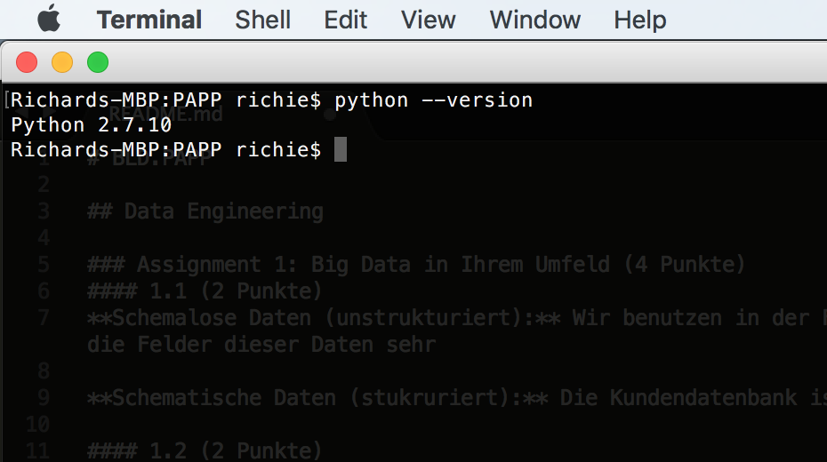

# BLD.PAPP

## Data Engineering

### Assignment 1: Big Data in Ihrem Umfeld (4 Punkte)

#### 1.1 (2 Punkte)
~~~
Schauen Sie sich in Ihrem Umfeld um. FH Technikum oder Ihr Job. Nennen Sie mindestens ein Beispiel für Daten, 
die schemalos (unstrukturiert) sind und mindestens ein Bespiel für Daten, die strukturiert (schematisch) sind.
~~~

**Schemalose Daten (unstrukturiert):** Wir benutzen in der Firma schemalose Daten, zum analysieren der Logfiles. Mit Logstash wird ein eine Elastic Search DB geschrieben. Die Daten werden mit Kibana angezeigt.

**Schematische Daten (stukruriert):** Die Kundendatenbank ist bei uns eine strukturierte Datenbank (SQL).

#### 1.2 (2 Punkte)
~~~
Nennen Sie ein Beispiel für Daten in Ihrem Umfeld, die gestreamt verarbeitet werden, 
nennen Sie ein Beispiel für Daten in Ihrem Umfeld, die über Batchverarbeitung verarbeitet werden.
~~~

**Beispiel für gestreamte Daten:** Es gibt ein das Framework log.io. Bei diesem Loggingframework werden die Logdatein gestream.

**Beispiel für Batchverarbeitete Daten:** Die automatischen Datenbankbackups sind Batchverarbeitete Daten. Ein weiteres Beispiel sind die Daten die in den unterschiedlichen Entwiicklungs Environments (Dev, Test, Beta, Prod) benötigt werden, auch diese werden mittels Batchverarbeitung kopiert.

### Assignment 2: Big Data in Ihrem Umfeld (4 Punkte)
~~~
Entscheiden Sie sich für eine Data Engineering Plattform. Apache Flink oder Apache Spark.
Installieren Sie die auf Ihrem Arbeitsgerät.
• 1. Punkt: Erklären Sie ihre Entscheidung
• 2. Punkte: Schicken Sie einen Screenshot der installierten Umgebung mit
• 1. Punkt: Beschreiben Sie Ihre Toolchain, die Sie mit dem Framework nutzen würden (z.B:IDE)
~~~

Ich habe mich für Apache Flink entschieden. Ich finde beide Plattformen interresant, bei Apache Flink gab es das Tutorial der Vorlesung, das für die installation befolgt wurde.

Flink kann auf der Downloadseite https://flink.apache.org/downloads.html heruntergeladen werden. Gestartet wird es mit bin/start-local.sh. Auf das Dashboard kann mit localhost:8081 zugegriffen werden.

Da Apache Flink Progamme mit Java erstellt werden können würde ich IntelliJ als Entwicklungsumgebung wählen. Die nötigen Abhängikeiten können mit Maven eingebunden werden.

### Assignment 3: Big Data in Ihrem Umfeld (4 Punkte)

~~~
Schreiben Sie ein simples Program mit dem Framework (z.B. Helloworld) und laden Sie es hoch.
• 2 Punkte für Programm_
• 2 Punkte, wenn das Programm auch ausführbar ist.
~~~

Als HelloWorld Beispiel würde das WordCount Example von [flink](https://github.com/apache/flink/blob/master/flink-examples/flink-examples-batch/src/main/java/org/apache/flink/examples/java/wordcount/WordCount.java)
 implementiert. Dabei handelt es sich um ein Java Programme welches mit Maven gebildet wird. Die nötigen Abhängigkeiten zu Apache Flink würden mit Maven aufgelöst. Es wurde das WordCount Beispiel implementiert und ein CharCount. Das Mainprogramm ist [hier](flink-example/src/main/java/Main.java). Die Tokenzier für Word- und CharCount liegen [hier](flink-example/src/main/java/Tokenizer.java).
 
 Um das programm auszuführen einfach in den Ordner `flink-example\target` wechseln (`cd flink-example\target`) und anschließend folgenden befehl auszuführen: `java -jar flink-word-char-count.jar`. Java sollte installiert sein damit dies funktioniert.

## Data Science

### Assignment 1: Technologien (4 Punkte)

#### 1.1 (2 Punkte)

~~~
Sie haben in der LVA zwei Frameworks kennengelernt (R und Python). Nennen Sie zwei weitere Technologien, 
um Daten zu analysieren (müssen nicht open source sein)
~~~

Neben R und Python gibt es noch Ruby, Perl, Kibana, tableau und d3.

~~~
#### 1.2 (2 Punkte)
Sie bekommen den Auftrag, sich mit einer Data Science Technologie zu arbeiten. Nennen Sie Technologie, 
die ihnen auf dem ersten Blick am besten für Sie ersscheint und begründen Sie das!
~~~

Ich würde als Data Science Technologie Python wählen. Da diese technologie sehr vielseitig eingesetzt werden kann und kann man sich schon in eine Technologie einliest, macht es sinn eine zu wählen, die vielseitig eingesetzt werden kann.

### Assignment 2: Technologien (4 Punkte)
~~~
Entscheiden Sie sich für eine Data Science Plattform. 
R oder Python Installieren Sie die auf Ihrem Arbeitsgerät.
• 1. Punkt: Begründen Sie ihre Entscheidung (Warum ziehen Sie 
		persönlich aus ihrer Ausgangssituation die eine Technologie der anderen vor).
• 2. Punkte: Schicken Sie einen Screenshot der installierten Umgebung mit
• 1. Punkt: Beschreiben Sie Ihre Toolchain, die Sie mit dem Framework nutzen (z.B. IDE)
~~~

Ich habe mich für Python entschieden, da ich diese ohnehin bereits lernen wollte da diese, wie in Assignment 1 1.2 beschrieben sehr vielseitig einsetzbar ist.
Python kann es unter www.python.org -> download heruntergeladen werden.

Auf einem Mac ist Python bereits vorinstalliert.

Die Python scripte werden simple mit vim erstellen, damit können diese auch auf Machinen ohne GUI erstellt werden. ( zb: Serverinstancen) 

### Assignment 3: Big Science (4 Punkte)

~~~
Der Cheatsheet auf http://scikit-learn.org/stable/tutorial/machine_learning_map/ 
ist eine einfache Anleitung, wie man den richtigen Algorithmus zum richtigen 
Data Science Problem findet. Schauen Sie in Google nach und lernen Sie 
classificatiom, regression, clusting und dimensional reduction unterscheiden.
Nennen Sie ein Beispiel aus ihrem Umfeld, wo Sie mit dem Algorithmus zu tun haben. 
Das kann ein Beispiel sein, wie: Wenn Sie bei Amazon einkaufen. 
Wenn Sie von einem Marketinginstitut angerufen werden, etc.
~~~

**classification (supervised)** Bei classification geht es darum neue Beobachtungen in den eine Kategorie einzuordnen. Diese Einordnung wird auf grund von einem Trainingset vorgenommen. Dies bedeutet das die Trainningsdaten schon vor der Einordnung zur Verfügung stehen.
Bsp: Email Spamfilter ("Spam", "non-Spam")

**regression (supervised)** Bei Regression geht es wie bei der CLassification um die vorhersage von Daten. Aber im gegensatz zu classification werden bei regression keine Kategorien verwendet sondern konkrete Werte. Ein oft genanntes Beispiel ist das Verkaufsverhalten vo Kunden in Onlineshop.

**clustering (unsupervised)** Clustering ist ähnlich der classification, nur gibt es hier kein Trainingsset, also keine Labels. Die Daten werden nach einem, zuvor festgelegten Algorithmus groupiert (geclustert). Wird bei der statistischen Daten analyse eingesetzt. 

**dimensionality reduction** wird verwendet um die Daten zu reduzieren. Diese Daten können anschließend mit classification, regression oder clustering weiterverarbeitet werden. Somit werden die Ergebnisse aus diesen Verfahren genauer.
